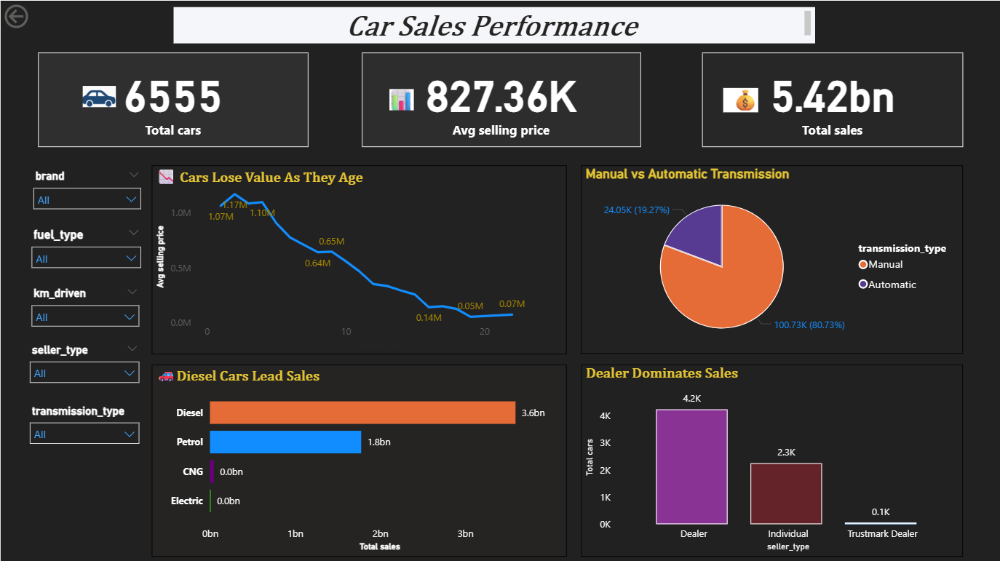

# 🚗 Car Sales Performance Dashboard (Power BI)

This project is a **Power BI dashboard** that analyzes used car sales data and highlights key business insights.  
It is designed to help stakeholders quickly understand **trends, patterns, and performance drivers** in the car resale market.

---

## 📊 Dashboard Features
- **KPI Cards**  
  - Total Cars: **6,555**  
  - Average Selling Price: **₹827K**  
  - Total Sales: **₹5.42B**  

- **Trend Analysis**  
  - Cars lose value as they age (clear depreciation trend).  

- **Fuel Type Performance**  
  - Diesel cars dominate sales (**₹3.6B**), followed by petrol (**₹1.8B**).  

- **Transmission Analysis**  
  - Manual cars dominate with **81% share**, while automatic cars make up **19%**.  

- **Seller Insights**  
  - Dealers contribute the majority of sales (**4.2K cars**), followed by individuals (**2.3K cars**).  

- **Interactive Filters**  
  - Brand (Audi, BMW, Ford, etc.)  
  - Fuel Type  
  - Transmission Type  
  - Seller Type  
  - Kilometers Driven  

---

## 🖼️ Dashboard Preview

---

## 🎯 Key Insights
1. **Depreciation** – Cars lose significant value after a few years of use.  
2. **Fuel Preference** – Diesel dominates the market, but petrol is still strong.  
3. **Transmission** – Manual transmission is the clear market leader.  
4. **Sales Channel** – Dealers remain the most trusted channel compared to individuals or trustmark dealers.  

---

## 📂 Files in this Repository
- `Car_Sales_Performance.pbix` → Power BI dashboard file  
- `Screenshots/` → Contains images of the dashboard  
- `README.md` → This documentation  

---

## 🚀 How to Use
1. Clone or download this repo.  
2. Open `Car_Sales_Performance.pbix` in **Power BI Desktop**.  
3. Explore and interact with the filters to generate insights.  

---

## 👨‍💻 Author
*Created by [Sagar Goud]*  
Data Analytics Enthusiast | Power BI | Python | SQL  

---

